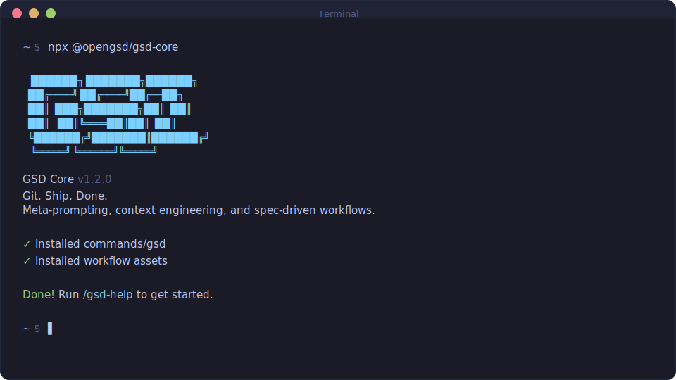

> ⚠️ This is an active fork. See the [English README](README.md) for the full notice about the original repo.

<div align="center">

# GSD Core

**Git. Ship. Done.**

[English](README.md) · **Português** · [简体中文](README.zh-CN.md) · [日本語](README.ja-JP.md)

**Um sistema leve e poderoso de meta-prompting, engenharia de contexto e desenvolvimento orientado a especificação para Claude Code, OpenCode, Gemini CLI, Kilo, Codex, Copilot, Cursor, Windsurf, Antigravity, Augment, Trae e Cline.**

**Resolve context rot — a degradação de qualidade que acontece conforme o Claude enche a janela de contexto.**

[](https://www.npmjs.com/package/@opengsd/gsd-core)
[](https://www.npmjs.com/package/@opengsd/gsd-core)
[](https://github.com/open-gsd/gsd-core/actions/workflows/test.yml)
[](https://discord.gg/mYgfVNfA2r)
[](https://github.com/open-gsd/gsd-core)
[](LICENSE)

<br>

```bash
npx @opengsd/gsd-core@latest
```

**Funciona em Mac, Windows e Linux.**

<br>



<br>

*"Se você sabe claramente o que quer, isso VAI construir para você. Sem enrolação."*

*"Eu já usei SpecKit, OpenSpec e Taskmaster — este me deu os melhores resultados."*

*"De longe a adição mais poderosa ao meu Claude Code. Nada superengenheirado. Simplesmente faz o trabalho."*

<br>

**Confiado por engenheiros da Amazon, Google, Shopify e Webflow.**

[Por que eu criei isso](#por-que-eu-criei-isso) · [Como funciona](#como-funciona) · [Comandos](#comandos) · [Por que funciona](#por-que-funciona) · [Guia do usuário](docs/pt-BR/USER-GUIDE.md)

</div>

---

## Por que eu criei isso

Sou desenvolvedor solo. Eu não escrevo código — o Claude Code escreve.

Existem outras ferramentas de desenvolvimento orientado por especificação. BMAD, Speckit... Mas quase todas parecem mais complexas do que o necessário (cerimônias de sprint, story points, sync com stakeholders, retrospectivas, fluxos Jira) ou não entendem de verdade o panorama do que você está construindo. Eu não sou uma empresa de software com 50 pessoas. Não quero teatro corporativo. Só quero construir coisas boas que funcionem.

Então eu criei o GSD. A complexidade fica no sistema, não no seu fluxo. Por trás: engenharia de contexto, formatação XML de prompts, orquestração de subagentes, gerenciamento de estado. O que você vê: alguns comandos que simplesmente funcionam.

O sistema dá ao Claude tudo que ele precisa para fazer o trabalho *e* validar o resultado. Eu confio no fluxo. Ele entrega.

— **TÂCHES**

---

Vibe coding ganhou má fama. Você descreve algo, a IA gera código, e sai um resultado inconsistente que quebra em escala.

O GSD corrige isso. É a camada de engenharia de contexto que torna o Claude Code confiável.

---

## Para quem é

Para quem quer descrever o que precisa e receber isso construído do jeito certo — sem fingir que está rodando uma engenharia de 50 pessoas.

Quality gates embutidos capturam problemas reais: detecção de schema drift sinaliza mudanças ORM sem migrations, segurança ancora verificação a modelos de ameaça, e detecção de redução de escopo impede o planner de descartar requisitos silenciosamente.

### Destaques de recursos

A versão canônica é a versão de `@opengsd/gsd-core` publicada no npm e espelhada em `package.json`. Arquivos antigos de release notes em `docs/` ficam apenas como histórico de continuidade; não use números arquivados como a versão atual do GSD Core.

- **Perfil de instalação `--minimal`** — alias `--core-only`. Instala apenas os 6 skills do loop principal (`new-project`, `discuss-phase`, `plan-phase`, `execute-phase`, `help`, `update`) e nenhum subagente `gsd-*`. Reduz o overhead do system prompt no cold-start de ~12k para ~700 tokens (≥94% de redução). Útil para LLMs locais com contexto de 32K–128K e APIs cobradas por token.
- **`/gsd-phase --edit`** — edita qualquer campo de uma fase existente em `ROADMAP.md` no lugar, sem alterar o número ou a posição. `--force` pula o diff de confirmação; referências em `depends_on` são validadas e o `STATE.md` é atualizado na escrita.
- **Build & test gate pós-merge** — o passo 5.6 de `execute-phase` agora detecta automaticamente o comando de build em `workflow.build_command`, com fallback para Xcode (`.xcodeproj`), Makefile, Justfile, Cargo, Go, Python ou npm. Projetos Xcode/iOS rodam `xcodebuild build` e `xcodebuild test` automaticamente. Funciona em modo paralelo e serial.
- **Modelo de review por runtime** — `review.models.<cli>` permite que cada CLI externa de review (codex, gemini, etc.) escolha seu próprio modelo, independente do perfil de planner/executor.
- **Herança de configuração de workstream** — quando `GSD_WORKSTREAM` está definido, o `.planning/config.json` raiz é carregado primeiro e merge-deep com o config da workstream (workstream vence em conflito). Um `null` explícito no config da workstream sobrescreve corretamente o valor raiz.
- **Consolidação de skills: 86 → 59** — 4 novos skills agrupados (`capture`, `phase`, `config`, `workspace`) absorvem 31 micro-skills. 6 skills pais existentes absorvem wrap-up e sub-operações como flags: `update --sync/--reapply`, `sketch --wrap-up`, `spike --wrap-up`, `map-codebase --fast/--query`, `code-review --fix`, `progress --do/--next`. Sem perda funcional.

---

## Primeiros passos

```bash
npx @opengsd/gsd-core@latest
```

O instalador pede:
1. **Runtime** — Claude Code, OpenCode, Gemini, Kilo, Codex, Copilot, Cursor, Windsurf, Antigravity, Augment, Trae, Cline, ou todos
2. **Local** — Global (todos os projetos) ou local (apenas projeto atual)

Verifique com:
- Claude Code / Gemini / Copilot / Antigravity: `/gsd-help`
- OpenCode / Kilo / Augment / Trae: `/gsd-help`
- Codex: `$gsd-help`
- Cline: GSD instala via `.clinerules` — verifique se `.clinerules` existe

> [!NOTE]
> Claude Code 2.1.88+ e Codex instalam como skills (`skills/gsd-*/SKILL.md`). Cline usa `.clinerules`. O instalador lida com todos os formatos automaticamente.

> [!TIP]
> Para instalação a partir do código-fonte ou ambientes sem npm, consulte **[docs/manual-update.md](docs/manual-update.md)**.

### Mantendo atualizado

```bash
npx @opengsd/gsd-core@latest
```

<details>
<summary><strong>Instalação não interativa (Docker, CI, Scripts)</strong></summary>

```bash
# Claude Code
npx @opengsd/gsd-core --claude --global
npx @opengsd/gsd-core --claude --local

# OpenCode
npx @opengsd/gsd-core --opencode --global

# Gemini CLI
npx @opengsd/gsd-core --gemini --global

# Kilo
npx @opengsd/gsd-core --kilo --global
npx @opengsd/gsd-core --kilo --local

# Codex
npx @opengsd/gsd-core --codex --global
npx @opengsd/gsd-core --codex --local

# Copilot
npx @opengsd/gsd-core --copilot --global
npx @opengsd/gsd-core --copilot --local

# Cursor
npx @opengsd/gsd-core --cursor --global
npx @opengsd/gsd-core --cursor --local

# Antigravity
npx @opengsd/gsd-core --antigravity --global
npx @opengsd/gsd-core --antigravity --local

# Augment
npx @opengsd/gsd-core --augment --global     # Install to ~/.augment/
npx @opengsd/gsd-core --augment --local      # Install to ./.augment/

# Trae
npx @opengsd/gsd-core --trae --global        # Install to ~/.trae/
npx @opengsd/gsd-core --trae --local         # Install to ./.trae/

# Cline
npx @opengsd/gsd-core --cline --global       # Install to ~/.cline/
npx @opengsd/gsd-core --cline --local        # Install to ./.clinerules

# Todos
npx @opengsd/gsd-core --all --global
```

Use `--global` (`-g`) ou `--local` (`-l`) para pular a pergunta de local.
Use `--claude`, `--opencode`, `--gemini`, `--kilo`, `--codex`, `--copilot`, `--cursor`, `--windsurf`, `--antigravity`, `--augment`, `--trae`, `--cline` ou `--all` para pular a pergunta de runtime.

</details>

### Recomendado: modo sem permissões

```bash
claude --dangerously-skip-permissions
```

> [!TIP]
> Esse é o modo pensado para o GSD: aprovar `date` e `git commit` 50 vezes mata a produtividade.

---

## Como funciona

> **Já tem código?** Rode `/gsd-map-codebase` primeiro para analisar stack, arquitetura, convenções e riscos.

### 1. Inicializar projeto

```
/gsd-new-project
```

O sistema:
1. **Pergunta** até entender seu objetivo
2. **Pesquisa** o domínio com agentes em paralelo
3. **Extrai requisitos** (v1, v2 e fora de escopo)
4. **Monta roadmap** por fases

**Cria:** `PROJECT.md`, `REQUIREMENTS.md`, `ROADMAP.md`, `STATE.md`, `.planning/research/`

### 2. Discutir fase

```
/gsd-discuss-phase 1
```

Captura suas preferências de implementação antes do planejamento.

**Cria:** `{phase_num}-CONTEXT.md`

### 3. Planejar fase

```
/gsd-plan-phase 1
```

1. Pesquisa abordagens
2. Cria 2-3 planos atômicos em XML
3. Verifica contra os requisitos

**Cria:** `{phase_num}-RESEARCH.md`, `{phase_num}-{N}-PLAN.md`

### 4. Executar fase

```
/gsd-execute-phase 1
```

1. Executa planos em ondas
2. Contexto novo por plano
3. Commit atômico por tarefa
4. Verifica contra objetivos

**Cria:** `{phase_num}-{N}-SUMMARY.md`, `{phase_num}-VERIFICATION.md`

### 5. Verificar trabalho

```
/gsd-verify-work 1
```

Validação manual orientada para confirmar que a feature realmente funciona como esperado.

**Cria:** `{phase_num}-UAT.md` e planos de correção se necessário

### 6. Repetir -> Entregar -> Completar

```
/gsd-discuss-phase 2
/gsd-plan-phase 2
/gsd-execute-phase 2
/gsd-verify-work 2
/gsd-ship 2
/gsd-complete-milestone
/gsd-new-milestone
```

Ou deixe o GSD decidir:

```
/gsd-progress --next
```

### Modo rápido

```
/gsd-quick
```

Para tarefas ad-hoc sem ciclo completo de planejamento.

---

## Por que funciona

### Engenharia de contexto

| Arquivo | Papel |
|---------|-------|
| `PROJECT.md` | Visão do projeto |
| `research/` | Conhecimento do ecossistema |
| `REQUIREMENTS.md` | Escopo v1/v2 |
| `ROADMAP.md` | Direção e progresso |
| `STATE.md` | Memória entre sessões |
| `PLAN.md` | Tarefa atômica com XML |
| `SUMMARY.md` | O que mudou |
| `todos/` | Ideias para depois |
| `threads/` | Contexto persistente |
| `seeds/` | Ideias para próximos marcos |

### Formato XML de prompt

```xml
<task type="auto">
  <name>Create login endpoint</name>
  <files>src/app/api/auth/login/route.ts</files>
  <action>
    Use jose for JWT (not jsonwebtoken - CommonJS issues).
    Validate credentials against users table.
    Return httpOnly cookie on success.
  </action>
  <verify>curl -X POST localhost:3000/api/auth/login returns 200 + Set-Cookie</verify>
  <done>Valid credentials return cookie, invalid return 401</done>
</task>
```

### Orquestração multiagente

Um orquestrador leve chama agentes especializados para pesquisa, planejamento, execução e verificação.

### Commits atômicos

Cada tarefa gera commit próprio, facilitando `git bisect`, rollback e rastreabilidade.

---

## Comandos

### Fluxo principal

| Comando | O que faz |
|---------|-----------|
| `/gsd-new-project [--auto]` | Inicializa projeto completo |
| `/gsd-discuss-phase [N] [--auto] [--analyze] [--chain]` | Captura decisões antes do plano (`--chain` encadeia automaticamente em plan+execute) |
| `/gsd-plan-phase [N] [--auto] [--reviews]` | Pesquisa + plano + validação |
| `/gsd-execute-phase <N>` | Executa planos em ondas paralelas |
| `/gsd-verify-work [N]` | UAT manual |
| `/gsd-ship [N] [--draft]` | Cria PR da fase validada |
| `/gsd-progress --next` | Avança automaticamente para o próximo passo |
| `/gsd-fast <text>` | Tarefas triviais sem planejamento |
| `/gsd-complete-milestone` | Fecha o marco e marca release |
| `/gsd-new-milestone [name]` | Inicia próximo marco |

### Qualidade e utilidades

| Comando | O que faz |
|---------|-----------|
| `/gsd-review` | Peer review com múltiplas IAs |
| `/gsd-pr-branch` | Cria branch limpa para PR |
| `/gsd-settings` | Configura perfis e agentes |
| `/gsd-config --profile <profile>` | Troca perfil (quality/balanced/budget/inherit) |
| `/gsd-quick [--full] [--discuss] [--research]` | Execução rápida com garantias do GSD (`--full` ativa todas as etapas, `--validate` ativa apenas verificação) |
| `/gsd-health [--repair]` | Verifica e repara `.planning/` |

> Para a lista completa de comandos e opções, use `/gsd-help`.

---

## Configuração

As configurações do projeto ficam em `.planning/config.json`.
Você pode configurar no `/gsd-new-project` ou ajustar depois com `/gsd-settings`.

### Ajustes principais

| Configuração | Opções | Padrão | Controle |
|--------------|--------|--------|----------|
| `mode` | `yolo`, `interactive` | `interactive` | Autoaprovar vs confirmar etapas |
| `granularity` | `coarse`, `standard`, `fine` | `standard` | Granularidade de fases/planos |

### Perfis de modelo

| Perfil | Planejamento | Execução | Verificação |
|--------|--------------|----------|-------------|
| `quality` | Opus | Opus | Sonnet |
| `balanced` | Opus | Sonnet | Sonnet |
| `budget` | Sonnet | Sonnet | Haiku |
| `inherit` | Inherit | Inherit | Inherit |

Troca rápida:
```
/gsd-config --profile budget
```

---

## Segurança

### Endurecimento embutido

O GSD inclui proteções como:
- prevenção de path traversal
- detecção de prompt injection
- validação de argumentos de shell
- parsing seguro de JSON
- scanner de injeção para CI

### Protegendo arquivos sensíveis

Adicione padrões sensíveis ao deny list do Claude Code:

```json
{
  "permissions": {
    "deny": [
      "Read(.env)",
      "Read(.env.*)",
      "Read(**/secrets/*)",
      "Read(**/*credential*)",
      "Read(**/*.pem)",
      "Read(**/*.key)"
    ]
  }
}
```

---

## Solução de problemas

**Comandos não apareceram após instalar?**
- Reinicie o runtime
- Verifique se os arquivos foram instalados no diretório correto

**Comandos não funcionam como esperado?**
- Rode `/gsd-help`
- Reinstale com `npx @opengsd/gsd-core@latest`

**Em Docker/container?**
- Defina `CLAUDE_CONFIG_DIR` antes da instalação:

```bash
CLAUDE_CONFIG_DIR=/home/youruser/.claude npx @opengsd/gsd-core --global
```

### Desinstalar

```bash
# Instalações globais
npx @opengsd/gsd-core --claude --global --uninstall
npx @opengsd/gsd-core --opencode --global --uninstall
npx @opengsd/gsd-core --gemini --global --uninstall
npx @opengsd/gsd-core --kilo --global --uninstall
npx @opengsd/gsd-core --codex --global --uninstall
npx @opengsd/gsd-core --copilot --global --uninstall
npx @opengsd/gsd-core --cursor --global --uninstall
npx @opengsd/gsd-core --antigravity --global --uninstall
npx @opengsd/gsd-core --augment --global --uninstall
npx @opengsd/gsd-core --trae --global --uninstall
npx @opengsd/gsd-core --cline --global --uninstall

# Instalações locais (projeto atual)
npx @opengsd/gsd-core --claude --local --uninstall
npx @opengsd/gsd-core --opencode --local --uninstall
npx @opengsd/gsd-core --gemini --local --uninstall
npx @opengsd/gsd-core --kilo --local --uninstall
npx @opengsd/gsd-core --codex --local --uninstall
npx @opengsd/gsd-core --copilot --local --uninstall
npx @opengsd/gsd-core --cursor --local --uninstall
npx @opengsd/gsd-core --antigravity --local --uninstall
npx @opengsd/gsd-core --augment --local --uninstall
npx @opengsd/gsd-core --trae --local --uninstall
npx @opengsd/gsd-core --cline --local --uninstall
```

---

## Community Ports

OpenCode, Gemini CLI, Kilo e Codex agora são suportados nativamente via `npx @opengsd/gsd-core`.

| Projeto | Plataforma | Descrição |
|---------|------------|-----------|
| [gsd-opencode](https://github.com/rokicool/gsd-opencode) | OpenCode | Adaptação original para OpenCode |
| gsd-gemini (archived) | Gemini CLI | Adaptação original para Gemini por uberfuzzy |

---

## Star History

<a href="https://star-history.com/#open-gsd/gsd-core&Date">
 <picture>
   <source media="(prefers-color-scheme: dark)" srcset="https://api.star-history.com/svg?repos=open-gsd/gsd-core&type=Date&theme=dark" />
   <source media="(prefers-color-scheme: light)" srcset="https://api.star-history.com/svg?repos=open-gsd/gsd-core&type=Date" />
   
 </picture>
</a>

---

## Licença

Licença MIT. Veja [LICENSE](LICENSE).

---

<div align="center">

**Claude Code é poderoso. O GSD o torna confiável.**

</div>
