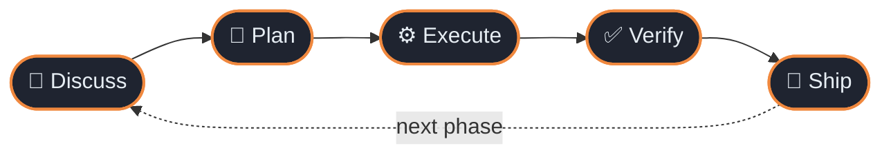
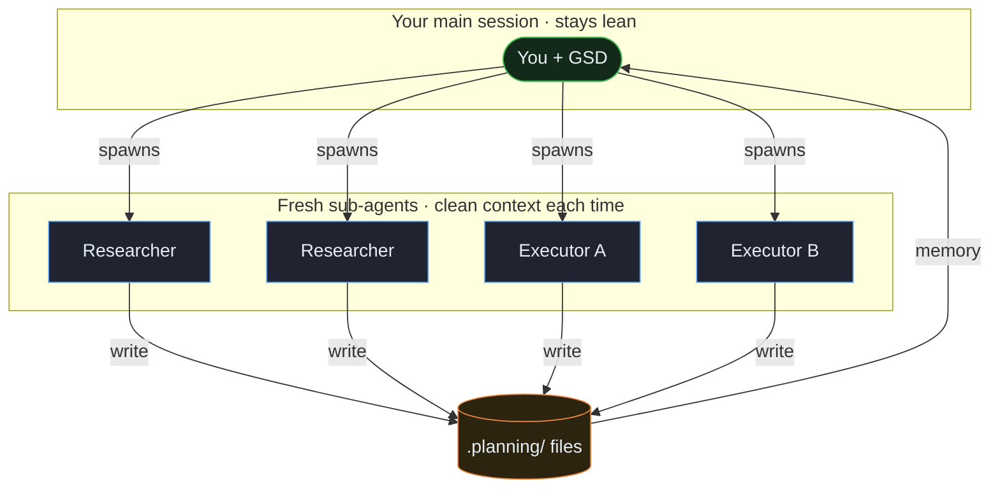
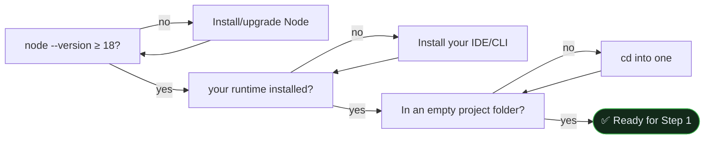
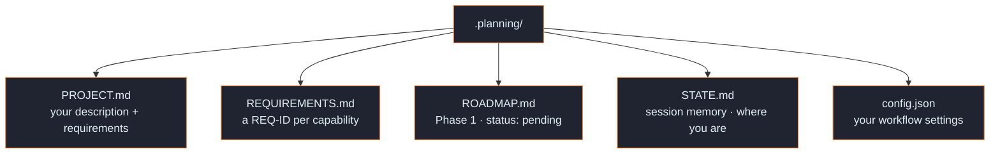
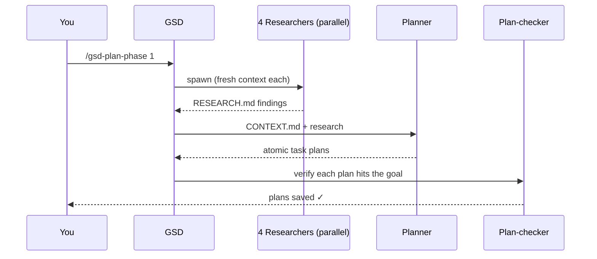
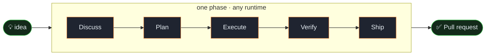

<!--
  Optional hero image (ships alongside this file as
  docs/tutorials/assets/your-first-project-hero.png):
  <p align="center"></p>
-->

<div align="center">

# 🚀 Your first project

**From an empty folder to a shipped pull request — in one guided loop. Works in every GSD runtime.**


</div>

> [!TIP]
> **This is the one guaranteed path.** You will build a tiny app, run **every**
> command in the core loop exactly once, and — the part most tutorials skip —
> understand *why* each step exists. It works whether you use **Cursor, Claude
> Code, OpenCode, Codex, Gemini CLI, Copilot, Windsurf** or any other supported
> runtime.

---

## 📖 Table of contents

1. [The one idea that makes GSD click](#-the-one-idea-that-makes-gsd-click)
2. [Pick your runtime](#-pick-your-runtime)
3. [What you'll build](#-what-youll-build)
4. [Prerequisites](#-prerequisites)
5. [Step 1 — Install GSD Core](#step-1--install-gsd-core-into-your-runtime)
6. [Step 2 — Open your runtime](#step-2--open-your-runtime)
7. [Step 3 — Create the project](#step-3--create-the-project)
8. [Step 4 — Discuss Phase 1](#step-4--clear-context-then-discuss-phase-1)
9. [Step 5 — Plan Phase 1](#step-5--plan-phase-1)
10. [Step 6 — Execute Phase 1](#step-6--execute-phase-1)
11. [Step 7 — Verify the work](#step-7--verify-the-work)
12. [Step 8 — Ship it](#step-8--ship-it)
13. [Glossary](#-mini-glossary) · [Troubleshooting](#-troubleshooting) · [What next](#-what-next)

---

## 💡 The one idea that makes GSD click

GSD Core does **not** "write your whole app in one shot." It runs a **repeating
five-step loop**, and it does the heavy thinking in **fresh, throwaway
sub-agents** so your main chat window never fills up with clutter — the quality
killer GSD calls [context rot](../explanation/context-engineering.md).

You drive that loop **one phase at a time**:



| Step | Command | In one sentence | Typical time |
|:----:|---------|-----------------|:------------:|
| 💬 **Discuss** | `/gsd-discuss-phase` | GSD asks *how* to build it and writes your answers down. | 2–4 min |
| 📐 **Plan** | `/gsd-plan-phase` | Researchers fan out; work is split into small, checkable tasks. | 1–5 min |
| ⚙️ **Execute** | `/gsd-execute-phase` | Fresh agents write the code and commit each task. | 2–6 min |
| ✅ **Verify** | `/gsd-verify-work` | GSD walks you through "does it actually work?" | 1–3 min |
| 🚀 **Ship** | `/gsd-ship` | A pull request is opened for you. | <1 min |

> [!NOTE]
> **Keep that table handy.** Whenever you feel lost, ask yourself one question:
> *"which step of the loop am I on?"* That's the entire mental model.

<details>
<summary>🧠 <b>Why fresh sub-agents? (the 30-second version)</b></summary>

<br>

A single long chat slowly degrades: the more it holds, the more the model
juggles, and quality quietly drops. GSD sidesteps this by spawning a **clean
200k-token worker** for each heavy job (research, execution) and throwing it away
after. Your main session stays lean; the shared `.planning/` files carry memory
between them.



</details>

---

## 🧩 Pick your runtime

GSD installs into whichever AI coding tool you use every day. **The eight steps
below are identical everywhere** — only two things differ per runtime:

1. the **`--flag`** you pass the installer, and
2. how you **invoke commands** (`/gsd-*`, the `/gsd:*` colon form, or plain
   language for rules-based runtimes).

| Runtime | Installer flag | How you invoke GSD |
|---------|----------------|--------------------|
| **Claude Code** | `--claude` | `/gsd-*` slash commands |
| **Cursor** | `--cursor` | `/gsd-*` (pair with the `gsd-cursor` EoS for model profiles) |
| **OpenCode** | `--opencode` | `/gsd-*` |
| **Codex** | `--codex` (CLI ≥ 0.130.0) | `/gsd-*` |
| **Gemini CLI** | `--gemini` | `/gsd:*` — **colon** form (`/gsd:new-project`) |
| **GitHub Copilot** | `--copilot` | `/gsd-*` |
| **Windsurf** | `--windsurf` | `/gsd-*` |
| **Kilo** | `--kilo` | `/gsd-*` |
| **Cline** | `--cline` | **rules** — no slash commands; just ask in plain language |
| **Qwen Code** | `--qwen` | `/gsd-*` |
| **Antigravity** | `--antigravity` | `/gsd:*` (Gemini-compatible) |
| **CodeBuddy · Augment · Trae · …** | `--<runtime>` | `/gsd-*` |

> [!NOTE]
> **How to read the rest of this guide.** Commands are written in the `/gsd-*`
> form. If you're on **Gemini CLI** or **Antigravity**, swap the hyphen for a
> colon (`/gsd:new-project`). If you're on **Cline**, there are no slash commands
> — just ask, e.g. *"start a new GSD project"*. Full per-runtime details:
> [Install on your runtime](../how-to/install-on-your-runtime.md).

---

## 🎯 What you'll build

A small **Node.js command-line to-do app**:

```bash
todo add "buy milk"      # ➕ add an item
todo list                # 📋 see open items
todo done 1              # ✅ complete item 1
```

Items live in a local `todos.json`. It uses **only the Node.js standard library**
— nothing to install, nothing to configure — so you focus entirely on the GSD
loop, not a toolchain.

> [!TIP]
> Small on purpose. Once the loop is muscle memory, the *exact same* eight steps
> scale to a real multi-phase product.

---

## ✅ Prerequisites

| You need | Check with | "Good" looks like |
|----------|------------|-------------------|
| **Node.js 18+** | `node --version` | `v18.x.x` or higher |
| **Your AI IDE / CLI** | Cursor, Claude Code, OpenCode, Codex, Gemini CLI… | installed and opens |
| **A terminal in an empty folder** | `pwd` | the project dir you want to use |
| **Internet** | — | needed once, for the installer |



---

## Step 1 — Install GSD Core into your runtime

From a terminal **in your project directory**, run the installer with **your
runtime's flag** (see [Pick your runtime](#-pick-your-runtime)):

```bash
npx @opengsd/gsd-core@latest --<your-runtime> --local
```

For example `--cursor`, `--claude`, `--opencode`, `--codex`, or `--gemini`. Use
`--local` for just this project (or `--global` for all projects). You'll see:

```text
✓ Installed 86 skills
✓ Installed agents
✓ GSD Core ready — run /gsd-new-project to start
```

Then **restart your runtime** so it picks up the new commands and agents.

<details>
<summary>💡 <b>What just happened?</b></summary>

<br>

A config directory now holds GSD's **commands** and **agents** — `.claude/` for
Claude Code, `~/.cursor/` for Cursor, `~/.config/opencode/` for OpenCode, and so
on. You never edit these by hand — the installer owns them, and it transforms
each command into your runtime's native format (for example, the `/gsd:*` colon
form for Gemini CLI, or `.clinerules` for Cline).

</details>

> [!WARNING]
> **Don't copy files from `agents/` or `commands/` directly** — that bypasses the
> per-runtime transformations and produces schema errors or missing commands.
> Always use the installer.

---

## Step 2 — Open your runtime

Open your IDE (Cursor, Codex, OpenCode, Windsurf…) or start your CLI. You'll land
at a prompt in your project directory.

> [!CAUTION]
> **Claude Code only — the permissions flag.** GSD spawns sub-agents that read and
> write files. Starting with `claude --dangerously-skip-permissions` skips the
> per-file confirmation — ideal for a throwaway tutorial in an empty folder. For
> real work, read the [security model](../explanation/security-model.md) first.
> Other runtimes handle agent file access their own way; no extra flag is needed.

---

## Step 3 — Create the project

At your runtime's prompt:

```text
/gsd-new-project
```

> [!NOTE]
> **Command syntax by runtime:** Gemini CLI / Antigravity → `/gsd:new-project`;
> Cline → just type *"start a new GSD project"*; everything else →
> `/gsd-new-project`. The same rule applies to every `/gsd-*` command below.

The first question is always **"What do you want to build?"** Paste this:

```text
A Node.js CLI tool for managing to-do items. Users run `todo add "buy milk"`,
`todo list`, and `todo done 1`. Items are saved to a local todos.json file.
No external dependencies — Node built-ins only.
```

Then answer the **clarifying questions**, choose **Skip research**, take the
**recommended defaults** for workflow settings, and wait for the **roadmapper**
(~1 min). Type **Approve** on the proposed roadmap:

```text
Proposed Roadmap
1 phase | 4 requirements mapped | All v1 requirements covered ✓

| # | Phase    | Goal                                   | Requirements    |
|---|----------|----------------------------------------|-----------------|
| 1 | Core CLI | add / list / done commands, todos.json | CLI-01 … CLI-04 |
```

<details>
<summary>💡 <b>What just got created in <code>.planning/</code>?</b></summary>

<br>



These files are GSD's **shared memory** — they survive `/clear`, survive closing
your laptop, and let a fresh sub-agent pick up exactly where the last left off.

</details>

👉 **Do this now:** open `.planning/ROADMAP.md`. Phase 1 has a **Goal**,
**Requirements**, and **Success Criteria** — the observable behaviours execution
must deliver. This file is your map for the rest of the tutorial.

---

## Step 4 — Clear context, then discuss Phase 1

GSD is built around **fresh contexts**. Clear the window before each phase:

```text
/clear
```

Then open the discussion:

```text
/gsd-discuss-phase 1
```

GSD asks about your **implementation preferences** — *how* to build, not just
*what*:

```text
> How should done items be stored — mark them in place or move them?
  Mark them in place with a "done" flag.
> Should `todo list` show completed items by default?
  No, hide them unless --all is passed.
> What if todos.json doesn't exist yet?
  Create it silently on first add.
```

It writes `.planning/phases/01-core-cli/CONTEXT.md`.

👉 **Do this now:** open that file → find `## Implementation Decisions`. Those are
your words, captured. The planner reads this next, so every decision here flows
into the task plans.

> [!NOTE]
> **Why discuss before planning?** Decide the small stuff up front and the plan is
> right the first time — instead of you correcting a wrong plan, choice by choice.

---

## Step 5 — Plan Phase 1

```text
/gsd-plan-phase 1
```



Four researchers fan out (`Spawning 4 researchers…`, 1–5 min — don't interrupt).
A **planner** turns `CONTEXT.md` + research into **atomic task plans**; a
**plan-checker** verifies each before saving.

<details>
<summary>💡 <b>What just got created?</b></summary>

<br>

```text
.planning/phases/01-core-cli/
  RESEARCH.md         ← domain findings
  01-01-PLAN.md       ← Task: todos.json read/write helpers
  01-02-PLAN.md       ← Task: add / list / done commands
```

</details>

👉 **Do this now:** open `01-01-PLAN.md`. Inside the `<task>` block: a name, the
files it touches, action steps, a `<verify>` command, and a "done" condition.
That `<verify>` isn't decoration — the executor runs it after writing code.

---

## Step 6 — Execute Phase 1

```text
/gsd-execute-phase 1
```

GSD groups plans into **waves** (independent plans run in parallel), spawns a
**fresh 200k-context executor per plan**, and commits each task atomically:

```text
Wave 1 (parallel):
  [Executor A] → 01-01-PLAN.md (read/write helpers)   ✓ committed
  [Executor B] → 01-02-PLAN.md (CLI commands)          ✓ committed

[Verifier] Checking codebase against phase goals...
  CLI-01 todo add   ✓   CLI-03 todo done  ✓
  CLI-02 todo list  ✓   CLI-04 --all flag ✓
  Status: PASS
```

**Run your app** — your first visible result:

```bash
node todo.js add "buy milk"
node todo.js add "write tests"
node todo.js list        # → both items
node todo.js done 1
node todo.js list        # → only "write tests"
```

🎉 Item 1 disappears from the default list after `done`. It works.

<details>
<summary>💡 <b>What just got created?</b></summary>

<br>

```text
.planning/phases/01-core-cli/
  01-01-SUMMARY.md    ← what Executor A built + committed
  01-02-SUMMARY.md    ← what Executor B built + committed
  VERIFICATION.md     ← requirement coverage: PASS
```

</details>

---

## Step 7 — Verify the work

```text
/gsd-verify-work 1
```

GSD extracts the phase's **success criteria** and walks each one:

```text
[1/3] Run `node todo.js add "buy milk"` without errors?   > yes
[2/3] Does `list` show only incomplete items by default?  > yes
[3/3] Does `done 1` complete item 1 and hide it?          > yes
All 3 checks passed. Phase 1 verified.
```

If a check **fails**, GSD diagnoses the root cause and writes a fix plan → re-run
`/gsd-execute-phase 1`, then `/gsd-verify-work 1` again. (Result:
`.planning/phases/01-core-cli/UAT.md`.)

> [!NOTE]
> **Why a separate verify step?** "The code was written" and "the code works" are
> different claims. Verify proves the second one *before* you open a PR.

---

## Step 8 — Ship it

```text
/gsd-ship 1
```

GSD creates a pull request with a generated body (Summary · Changes ·
Requirements Addressed · Verification · Key Decisions):

```text
Pull request created: https://github.com/your-org/your-repo/pull/1
Title: feat(phase-1): core CLI — add / list / done commands
```

That's the **full loop** — idea → merged PR — for one phase, on **any runtime**. 🚀



---

## 🔁 Doing more than one phase

For a multi-phase project, repeat **Steps 4–8** for each phase. Not sure what's
next? Let GSD detect it:

```text
/gsd-progress --next
```

---

## 📚 Mini-glossary

| Term | Meaning in GSD |
|------|----------------|
| **Runtime** | Your AI IDE/CLI: Cursor, Claude Code, OpenCode, Codex, Gemini CLI, … |
| **Phase** | One slice of the roadmap you take through the whole loop. |
| **The loop** | Discuss → Plan → Execute → Verify → Ship. |
| **Sub-agent** | A fresh, throwaway worker GSD spawns for research or execution. |
| **Context rot** | Quality decay as the main window fills up; fresh sub-agents prevent it. |
| **`.planning/`** | GSD's shared memory: PROJECT, REQUIREMENTS, ROADMAP, STATE, per-phase files. |
| **Requirement (REQ-ID)** | A single v1 capability the roadmap must cover, e.g. `CLI-01`. |
| **Success criteria** | Observable behaviours a phase must deliver, checked in Verify. |
| **Wave** | A batch of independent task plans executed in parallel. |

---

## 🛟 Troubleshooting

| Symptom | Likely cause | Fix |
|---------|--------------|-----|
| A GSD command isn't recognized | Wrong syntax for your runtime, or runtime not restarted | Gemini CLI/Antigravity use `/gsd:*`; Cline uses plain language. Restart the runtime after install. |
| `Spawning researchers…` looks stuck | Research runs 1–5 min | Wait — don't interrupt. If truly hung, `/clear` and re-run the step. |
| Verify keeps failing | Real bug in the code | Let GSD write the fix plan → `/gsd-execute-phase 1` → re-verify. |
| Lost track of where you are | — | Open `.planning/STATE.md`, or run `/gsd-progress --next`. |
| Wrong install directory | Prerelease edition (Cursor Nightly, etc.) | Set the matching `*_CONFIG_DIR` env var — see [Install on your runtime](../how-to/install-on-your-runtime.md). |

---

## 🎓 What next

- [Install on your runtime](../how-to/install-on-your-runtime.md) — exact steps for all 15 runtimes
- [The phase loop](../explanation/the-phase-loop.md) — why it's shaped this way
- [Context engineering](../explanation/context-engineering.md) — the theory behind fresh sub-agents
- [Configure model profiles](../how-to/configure-model-profiles.md) — quality / balanced / budget tiers
- [Onboarding an existing codebase](onboarding-an-existing-codebase.md) — bring GSD to a brownfield repo

> [!TIP]
> **You now know the whole loop.** Everything else in GSD is a refinement of these
> eight steps — and it works the same in every runtime. Welcome aboard. 🚀
